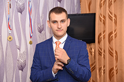

# Yatsenko Sergey



## My contact info

* Phone: +7(987)334-15-46;
* Mail: [yatsenko1998@yandex.ru](yatsenko1998@yandex.ru)
* GitHub: [Sergey-98](https://github.com/Sergey-98)
* Telegram: [Sergey Yatsenko](https://t.me/YatsenkoS98)


## About me

My name is Sergey Yatsenko.

I am 23 years old. I am a graduate of the Saratov State Technical University. During my studies, I was engaged in programming robotic platforms, participated in competitions. Now I work as a design engineer. I sure that my work does not give me development, so I want to learn to program. By doing programming, I can constantly develop, improve my strengths and weaknesses. I like web development because I can write something and see the result right away. That’s why I’m here.

* My strengths:
    + Purposefulness
    + Stress resistance
    + Desire to learn all my life
    + Punctuality
## Skills

* Python (at university)
* С++ (at university)
* HTML
* CSS
* JS
* Git, GitHub


## Code Example
### CODEWARS: 
Write a function that converts any sentence into a V A P O R W A V E sentence. a V A P O R W A V E sentence converts all the letters into uppercase, and adds 2 spaces between each letter (or special character) to create this V A P O R W A V E effect.

```
function vaporcode(string) {
  let arr = string.split('');
  let newArr = [];
  for (let i = 0; i < arr.length; i++) {
    if (arr[i] !== ' ') {
      newArr.push(arr[i]);
    }
    else {
      continue;
    }
    
  }
  for (let i = 0; i<newArr.length;i++) {
    newArr[i] = newArr[i].toUpperCase();  
  }
  return(newArr.join('  '));
  }
```
## Work Experience 
*This CV...* 

## Education
* Saratov State Technical University
    + Master’s degree in management in technical systems
* Udemy
    + HTML, CSS
    + JS
* HTML Academy

## Languages
* Russian - native speaker
* English - A2
